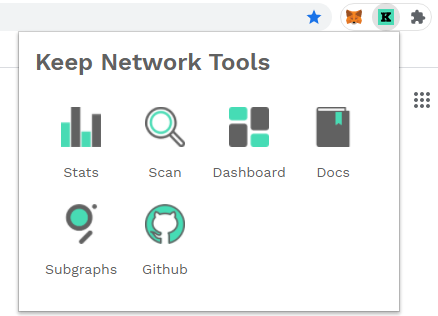

# keep-chrome-extension

This is Keep Tools extension for Google Chrome for faster access.

## Installation

To install extension: 

1. Download files to your local computer

2. Open Chrome, at the top right menu open **More tools** -> **Extensions**

3. At the to right conner turn on the Developer Mode

4. Choose "Load unpacked extension"

5. Add folder with downloaded files

Now you can click on Extensions icon at the top right corner and pin it to your extensions panel

You can easily add your own links or change existing ones by changing `a` tag in `index.html` file